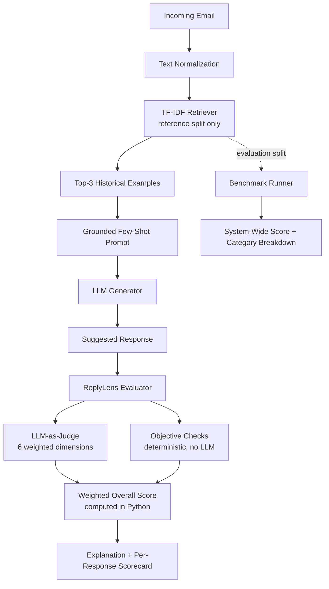

# ReplyLens AI


## Live Demo

🚀 **Deployed Application:**

The application is deployed using Streamlit Community Cloud. The deployed version uses the configured LLM provider through secure platform secrets; API keys are not stored in the GitHub repository.


**Explainable AI suggested-response generation and evaluation**, built for the
Hiver AI Email Suggested-Response Challenge.

---

## Problem

Suggested-response systems for support email are usually judged the wrong
way: by comparing the generated reply to *one* historical reply and scoring
how closely the words match (exact match, BLEU, ROUGE, cosine similarity to
a single reference). That's a poor proxy for quality, because:

- Two replies can use completely different wording and both be excellent —
  or use very similar wording and both be useless ("Thanks for reaching
  out, we'll look into it!").
- A reply can be fluent and on-topic while still being wrong: it can
  hallucinate a refund amount, a delivery date, or a policy that was never
  stated anywhere.
- A reply can be factually safe but still not actually resolve anything —
  pure acknowledgment with no next step.

None of these failure modes are visible to a single-reference text-similarity
metric. ReplyLens AI instead evaluates a generated response against the
*incoming email itself* and the *pattern* of similar historical resolutions,
across six independent, weighted quality dimensions — with both an LLM
judge and deterministic, rule-based checks feeding into the final score.

## Solution

1. Retrieve the 3 most similar historical email/reply pairs for a new
   incoming email (TF-IDF, restricted to a "reference" split of the
   dataset).
2. Use those examples as few-shot, style/context grounding for an LLM to
   generate a suggested reply — never as a template to copy.
3. Score the generated reply with the **ReplyLens Quality Score**: six
   weighted dimensions scored by an LLM judge, cross-checked with
   deterministic objective checks that don't depend on any LLM call.
4. Compute the final weighted score **in Python**, not by trusting an
   LLM's self-reported total.
5. Run the same pipeline over a held-out evaluation split to get a
   system-wide score, and separately correlate the automated score against
   a small set of human ratings to sanity-check the metric itself.

## Architecture



## Dataset

- **Fully synthetic.** `data/generate_dataset.py` builds 405 email/reply
  pairs from fictional names, order IDs, products, and dates combined with
  hand-written category templates and a fixed random seed. **No real
  customer, company, or Hiver data was used or scraped.**
- **Why synthetic:** it's reproducible (same seed → same file), avoids any
  privacy/IP concern, and lets us control category balance for a meaningful
  benchmark — a real inbox export would be imbalanced, messy, and legally
  off-limits for this challenge.
- **Categories (15):** refund_request, order_status, delayed_delivery,
  damaged_product, cancellation, account_access, password_reset,
  billing_issue, duplicate_charge, subscription_cancellation,
  product_information, complaint, technical_support, address_change,
  exchange_request.
- **Fields:** `id, category, incoming_email, historical_reply, intent,
  resolution_type, split`.
- **Split:** stratified 80% `reference` / 20% `evaluation` per category
  (330 / 75 records). Retrieval only ever queries the `reference` rows, so
  evaluation-split emails can never leak into the few-shot context used to
  generate or judge their own response.
- **Regenerate anytime:** `python data/generate_dataset.py` (deterministic,
  seed=42). A checked-in copy (`data/emails.csv`) ships with the repo so the
  app runs immediately without regenerating anything.
- **Limitations:** template-based synthetic data is less linguistically
  diverse than real customer email — phrasing patterns repeat more than
  they would in the wild. This is an acceptable trade-off for a
  reproducible, privacy-safe demo dataset, not a claim that it represents
  real-world email distribution.

## Response Generation

- `services/retrieval_service.py` — TF-IDF + cosine similarity over the
  reference split, top-3 by default.
- `services/generation_service.py` — builds a grounded prompt
  (`prompts/generation_prompt.txt`) instructing the model to: answer the
  actual intent, use retrieved examples for style only, never copy them
  blindly, never invent facts/policies/prices/dates not present in the
  email, and acknowledge missing information rather than guessing.
- `services/llm_service.py` — provider-agnostic OpenAI-compatible client
  (works with OpenAI, OpenRouter, or any compatible endpoint) configured
  entirely through environment variables. No key is ever hard-coded.
- **Demo Mode:** if `LLM_API_KEY` is unset (or a call fails), generation
  creates a new clearly-labeled deterministic response composed from the
  incoming email, its retrieved category/intent guidance, and supported
  evidence from retrieved examples. It does not copy a historical reply.
  Evaluation uses deterministic, response-dependent scoring from the email,
  objective checks, and retrieved evidence. This is not equivalent to the
  live LLM judge.

## Accuracy / Evaluation

This is the core of the project — the challenge explicitly calls out
evaluation methodology as the most important part.

**Why not exact match?** Two valid replies rarely share exact wording;
exact match would mark almost everything wrong.

**Why not BLEU/ROUGE alone?** These measure n-gram overlap with a single
reference reply. A reply that says "I've refunded your order, expect it in
5-7 days" scores low against a reference that says "Your refund of $49.99
has been processed" — despite both being good — while a reply that mimics
the reference's phrasing but promises the wrong amount could score high.
N-gram overlap cannot distinguish factually correct paraphrase from
factually wrong copying.

**Why not semantic similarity alone (e.g. plain embedding cosine to the
reference reply)?** It closes the paraphrase gap somewhat, but still
can't detect hallucinated facts, missed parts of a multi-part question, or
an unhelpful-but-topically-similar non-answer ("Thanks for your email
about your order!").

**Why not an LLM score alone?** LLM judges can be inconsistent, are
sensitive to prompt wording, and are themselves capable of hallucinating a
justification for a score. Using one holistic 1-100 "how good is this"
question also hides *why* something scored the way it did, and provides no
independent, non-LLM sanity check on the judge's own reliability.

**ReplyLens's answer:** decompose "quality" into six weighted, individually
explainable dimensions, judged against the incoming email and the *pattern*
of retrieved historical resolutions (not a single reference reply), and
cross-check the judge with deterministic checks that don't depend on any
LLM call at all:

| Dimension | Weight | What it captures |
|---|---|---|
| Intent Alignment | 20% | Did it understand what's actually being asked/reported? |
| Resolution / Actionability | 25% | Does it move the issue forward with a real next step, not just acknowledge it? (Weighted highest — an accurate-but-inactionable reply is still a failed support interaction.) |
| Factual Consistency | 20% | Does it avoid inventing facts, prices, dates, refunds, or commitments not in the email/context? (Weighted second-highest — hallucinated commitments are the most damaging failure mode in a real support tool.) |
| Completeness | 15% | Does it address every important part of a (possibly multi-part) email? |
| Tone & Professionalism | 10% | Polite, professional, appropriately empathetic. |
| Reference Alignment | 10% | Does the approach match the pattern of similar historical resolutions? (Lowest weight — it's a useful sanity signal, but a good reply shouldn't be penalized just for diverging in wording from past replies.) |

The **overall score is always recomputed in Python** from the six
per-dimension scores (`services/evaluation_service.py:compute_weighted_score`)
— the LLM judge is never trusted to self-report a final number, per the
challenge's explicit requirement.

**Objective checks (no LLM, fully deterministic)**, run independently and
shown separately in the UI so the evaluation is visibly not "just another
LLM saying good/bad":

- non-empty response
- reasonable length (5-350 words)
- greeting present
- sign-off present
- no verbatim-repeated 4+ word phrases
- no numeric values (prices, quantities) in the response that are not
  supported by the email or retrieved evidence (a hallucination proxy)
- no order-ID mismatches against the email or retrieved evidence
- no unsupported dates or relative time claims

There are **8 objective checks** in total: non-empty response, reasonable
length, greeting, sign-off, no repeated phrases, supported numbers, consistent
order IDs, and supported dates. TF-IDF topical relevance is also calculated
and displayed as a separate deterministic signal; it is not one of these
eight pass/fail checks.

*Known limitation of the objective checks:* they are blunt deterministic
signals. Supported numbers and dates from the email or retrieved evidence are
allowed, but generic unsupported claims that contain no detectable number,
date, or order ID can still require human review.

## Metric Validation

`evaluation/calibration_examples.json` contains **24 hand-written
incoming-email / generated-response pairs**, each with a **1-5 human
quality rating** and short notes, deliberately spanning excellent,
mediocre, and clearly broken (including hallucinated facts and
ignored-the-request) responses.

`evaluation/benchmark.py:run_calibration()` runs each of those fixed
responses through the ReplyLens evaluator and computes the **Spearman rank
correlation** (via `scipy.stats.spearmanr`, with a manual fallback if scipy
is unavailable) between the human 1-5 ratings and the automated 0-100
overall scores. This is surfaced in the UI under "Human-calibration
correlation."

The verified Demo Mode calibration result is **Spearman rho = 0.506** for
**24 cases**. The held-out Demo Mode benchmark covers **75 evaluation
records**, with **0 retrieval leakage** from the evaluation split. Its latest
verified aggregate is:

| Metric | Result |
|---|---:|
| Mean overall | 69.4 |
| Median overall | 74.5 |
| Standard deviation | 13.1 |
| Minimum | 43.8 |
| Maximum | 87.8 |

**Honest caveats — please read before citing this number:**
- n≈24 is a small, illustrative sample, not a statistically powered study.
- Ratings were assigned by a single reviewer (the project author) during
  development, not an independent, blinded panel of annotators — so it
  cannot rule out the reviewer having (consciously or not) picked examples
  or ratings that flatter the metric design.
- This is meant to demonstrate a *thoughtful validation methodology* the
  approach could be scaled to (more raters, blind rating, more examples,
  inter-rater agreement), not to prove the ReplyLens score is universally
  valid. A production deployment would need a much larger, independently
  rated calibration set before trusting the score for decisions like
  auto-sending replies.

## Trade-offs

- **Synthetic dataset vs. real data:** reproducible and privacy-safe, but
  less linguistically diverse than real inboxes; real data would need
  anonymization and legal clearance out of scope for this challenge.
- **TF-IDF vs. dense embeddings / vector DB:** TF-IDF is fast, dependency-light,
  and fully reproducible for a few hundred records; it's lexical rather than
  semantic, so heavily paraphrased queries with little vocabulary overlap
  may retrieve weaker matches than embeddings would. A vector DB would be
  overkill at this dataset size.
- **LLM-as-judge:** captures nuance rule-based checks can't, but is itself
  an LLM opinion — mitigated by (a) deterministic objective checks run in
  parallel, (b) recomputing the overall score in Python rather than trusting
  the judge's self-reported total, and (c) the small human-calibration check.
- **Latency/cost:** each full evaluation costs 2 LLM calls (generate +
  judge); the system benchmark over 75 evaluation emails costs ~150 calls.
  A slider in the UI lets you run a smaller subset for a quick check.
- **Reproducibility:** dataset generation and retrieval are fully
  deterministic (fixed seed); LLM generation/judging are not (temperature
  0.0 is used for the judge to minimize this, but provider-side variance
  can still occur).
- **Evaluator bias:** the judge and generator can share the same underlying
  model/provider in a given run, which risks the judge being lenient toward
  that model's own style. Using a different/stronger model as `LLM_MODEL`
  for judging than for generation is a reasonable mitigation not
  implemented here, to keep the project simple.

## Running Locally

```bash
python -m venv venv

# macOS/Linux
source venv/bin/activate
# Windows PowerShell or Command Prompt
venv\Scripts\activate

pip install -r requirements.txt

# macOS/Linux
cp .env.example .env
# Windows
copy .env.example .env

# edit .env and set LLM_API_KEY (and LLM_BASE_URL / LLM_MODEL if needed)

streamlit run app.py
```

**Optional environment variables** (see `.env.example`):

- `LLM_API_KEY` — your provider API key. If left blank, the app runs in
  Demo Mode (see below) instead of crashing.
- `LLM_BASE_URL` — OpenAI-compatible base URL (default:
  `https://api.openai.com/v1`; works with OpenRouter or any compatible
  proxy too).
- `LLM_MODEL` — model identifier as expected by your provider.

The application loads a local `.env` file when present, reads process
environment variables, and falls back to Streamlit Cloud Secrets when a
process value is absent. Existing deployment environment values take
precedence because `load_dotenv()` does not override them by default.
For Streamlit Cloud, add `LLM_API_KEY`, `LLM_BASE_URL`, and `LLM_MODEL` under
the app's Secrets settings. Configure secrets through the deployment
platform, and never commit `.env`; it is ignored by Git.

The dataset (`data/emails.csv`) is checked in, so no setup is needed there;
regenerate it any time with `python data/generate_dataset.py`.

**Deterministic Demo Mode:** if `LLM_API_KEY` is absent, retrieval, objective
checks, and response-dependent six-dimension scoring run offline. Generation
creates a new deterministic response from the incoming email, category/intent,
and supported retrieved evidence; it does not copy a historical reply. This
mode is clearly labeled and is not equivalent to a live LLM judge.

**Live LLM Mode:** when `LLM_API_KEY` is configured, the application uses the
OpenAI-compatible endpoint configured by `LLM_BASE_URL` and `LLM_MODEL` for
response generation and LLM-as-judge evaluation. These variables are optional
for Demo Mode.

## Example

Incoming email:

> Hi, I'd like to request a refund for order ORD-48213. The wireless
> headphones I received don't work at all.

Generated response (live LLM run):

> Hi there, I'm sorry to hear the headphones aren't working. I've
> initiated a refund for order ORD-48213 — you should see the amount back
> on your original payment method within 5-7 business days. Let me know if
> there's anything else I can help with.

ReplyLens evaluation:

```
Overall Quality: 91/100
Intent Alignment: 95        Resolution: 90        Factual Consistency: 92
Completeness: 88            Tone: 94               Reference Alignment: 85

Strengths: correctly identifies the refund request; takes concrete action
with a timeline; empathetic, professional tone.
Improvements: could confirm the refund amount if it were known from context.
```

Objective checks: 8/8 passed (greeting ✅, sign-off ✅, supported numbers and
dates, order ID consistent with the source email/evidence ✅).

## Limitations

- LLM-as-judge scores are not perfectly reproducible run-to-run, even at
  temperature 0.0, since provider-side sampling can vary slightly.
- Objective checks are deterministic signals rather than a complete semantic
  proof; supported numbers and dates from the email or retrieved examples are
  allowed, but unusual unsupported claims can still require human review.
- TF-IDF retrieval is lexical; it can miss semantically similar emails that
  use very different wording than the reference set.
- The synthetic dataset's category templates are somewhat repetitive by
  design (reproducibility over diversity) and don't capture the full messiness
  of real customer email (typos, multi-topic emails, non-English text, etc.).
- The calibration correlation is based on a small, single-reviewer sample
  and should not be read as proof of general metric validity (see "Metric
  Validation" above).
- No authentication, persistence, or multi-user support — out of scope for
  this challenge per its own guidance to avoid unnecessary infrastructure.

## AI Usage Disclosure

AI coding assistants were used during development for implementation
assistance, debugging, code suggestions, and documentation drafting. The
architecture, evaluation methodology, metric selection, trade-off decisions,
and final validation were reviewed, tested, and adapted as part of the
project development.

---

## Project Structure

```
replylens-ai/
├── app.py
├── requirements.txt
├── README.md
├── .env.example
├── .gitignore
│
├── data/
│   ├── emails.csv
│   └── generate_dataset.py
│
├── evaluation/
│   ├── calibration_examples.json
│   ├── benchmark.py
│   └── metrics.py
│
├── services/
│   ├── llm_service.py
│   ├── retrieval_service.py
│   ├── evaluation_service.py
│   └── generation_service.py
│
├── prompts/
│   ├── generation_prompt.txt
│   └── evaluation_prompt.txt
│
└── utils/
    └── helpers.py
```
